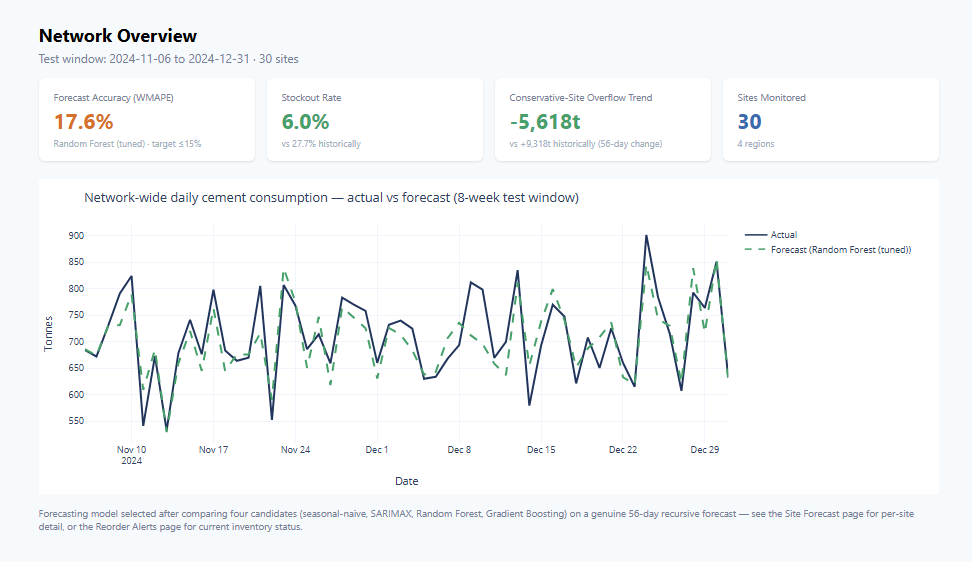
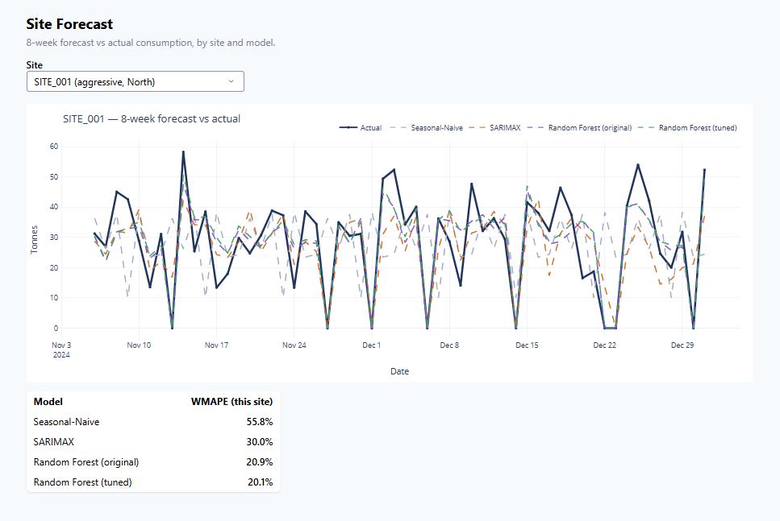
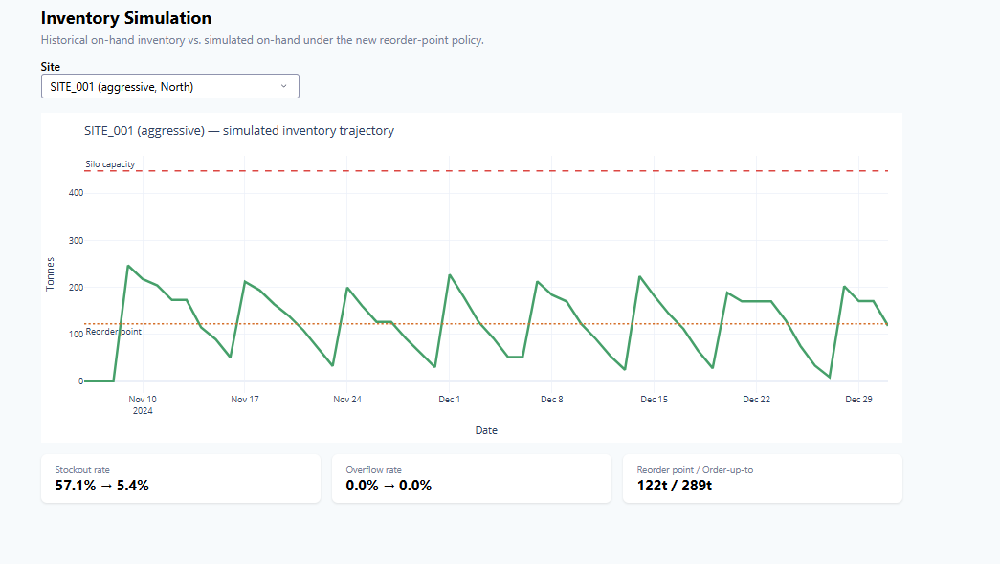
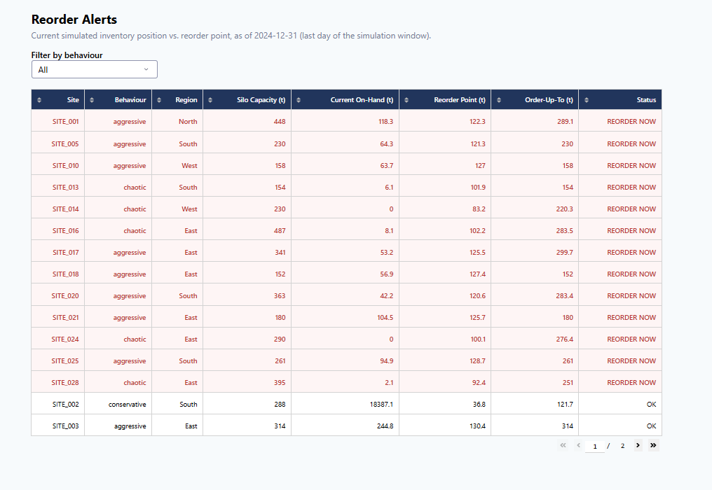

# Mig-Cement-Demand-Forecasting

Forecasting cement demand to reduce stockouts and overstocking across a national construction
site network.

## The Problem

Midlands Infrastructure Group (MIG) manages 25–40 concurrent construction sites and relies on
manual, reactive cement ordering. This causes two opposite failure modes at different sites:
some chronically **run out** of stock before scheduled pours, others **massively overstock**,
tying up capital and risking material waste. This project builds a forecasting model and a
data-driven reorder-point framework to fix both.

## Key Findings

- **The real problem wasn't demand volatility — it was ordering behaviour.** Sites cluster into
  three distinct ordering styles: *aggressive* sites stock out on **57.5%** of scheduled pours;
  *conservative* sites sit at roughly **39x** their silo capacity on average, three years of
  accumulated over-ordering.
- **A tuned Random Forest forecasts 8 weeks ahead at 17.6% WMAPE** (weighted MAPE — used instead
  of standard MAPE since 12.5% of days have zero actual demand, which breaks MAPE
  mathematically), beating a seasonal-naive baseline (65.7%), SARIMAX (26.9%), and Gradient
  Boosting (20.5%).
- **A forecast-driven reorder-point policy, simulated against real historical outcomes**, cuts
  the stockout rate from 27.7% to 6.0%, and reverses the overstocking trend at every affected
  site (from +9,318 tonnes of growing excess over 8 weeks, to -5,618 tonnes actively draining).

Full reasoning and evidence for every finding above is in the notebooks — nothing here is
asserted without a number behind it.

## Results vs. Original Targets

| Target | Result |
|---|---|
| Forecast accuracy ≤15% (MAPE) | 17.6% (WMAPE) — short of target, see `docs/validation_and_deployment.md` for why |
| ≥98% pour readiness | Stockout rate cut from 27.7% to 6.0% — large improvement, short of the strict target within an 8-week window |
| 20% improvement, silo utilization efficiency | **344% relative improvement** in healthy-utilization site-days (10.9% → 48.4%) |
| 30% reduction in material write-offs | Overstocking trend reversed (proxy metric); full reduction needs a longer horizon than 8 weeks |

See `docs/validation_and_deployment.md` for the full validation writeup, including an honest
account of what was and wasn't achieved, and why.

## Dashboard


*Network-wide KPIs and forecast accuracy at a glance.*


*Per-site forecast vs actual, with model comparison.*


*Simulated inventory trajectory against reorder point and silo capacity.*


*Live reorder status across all 30 sites.*

## Repository Structure

```
├── data/                          Raw source data (SQLite database)
├── notebooks/                     Full pipeline, in order:
│   ├── 01_data_cleaning.ipynb        Load, validate, join, engineer baseline fields
│   ├── 02_data_profiling.ipynb       Structural/statistical characterization
│   ├── 03_eda.ipynb                  Univariate/bivariate/multivariate analysis
│   ├── 04_feature_engineering.ipynb  Lag, rolling, weather, calendar, behaviour features
│   ├── 05_modelling.ipynb            4-model comparison, genuine 8-week recursive forecast
│   ├── 05b_model_tuning.ipynb        Hyperparameter search, feature importance, ensembling
│   └── 06_inventory_simulation.ipynb Reorder-point framework, policy simulation
├── app/                           Plotly Dash dashboard (run: python app/dashboard.py)
├── models/                        Saved trained model artifact
├── outputs/                       Pipeline outputs (cleaned data, forecasts, reorder points)
├── docs/                          Validation & deployment writeup
└── screenshots/                   Dashboard screenshots for this README
```

## Tech Stack

Python · pandas · scikit-learn · statsmodels (SARIMAX) · Plotly / Dash · SQLite

## How to Run

1. Clone the repo.
2. Install dependencies: `pip install pandas numpy scikit-learn statsmodels matplotlib seaborn pyarrow dash plotly joblib`
3. Run the notebooks in `notebooks/` **in numbered order** — each one depends on the previous
   step's output (e.g. `04_feature_engineering.ipynb` requires `01_data_cleaning.ipynb` to have
   run first).
4. Once the notebooks have run, launch the dashboard: `cd app && python dashboard.py`, then open
   `http://127.0.0.1:8050`.

## Full Writeup

See [`docs/validation_and_deployment.md`](docs/validation_and_deployment.md) for the complete
validation summary, deployment plan, monitoring framework, and known limitations.
